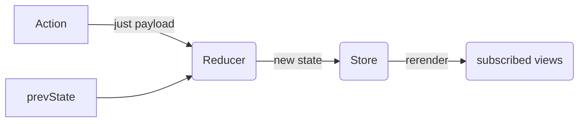

Redux and Mobx are two most popular state management tools for React apps, representing different design philosophis as object-oriented programming and functional programming. Recently, a new context api has been proposed to provide a native global store solution and received a lot of discussions. Here's a brief comparion of different methods. I have to say before hand, most things in software engineering are based on opinions and tradeoffs, not facts or hard truth. 


## Redux

Basic data flow:




### Action

Actions are just plain object that contains `type` and `payload` property, such as 
```
{
    type: ADD_TODO,
    payload: text
}
```
Actions should be returned by action creaters.

### Reducer

Reducers are just pure functions that take the previous `related` state and action, then return the new state

Reducers can be combined together by using a function `combineReducers` from `redux`

### Store

Single source of truth. Store should be created at the root level,
```js
import { createStore } from 'redux'
import { Provider } from 'react-redux'
import App from './components/App'
import reducer from './reducers'
...
const store = createStore(reducer)

render(
  <Provider store={store}>
    <App />
  </Provider>,
  document.getElementById('root')
)
```

### APIs

- [createStore](https://redux.js.org/api-reference/createstore)
    - create the single store at root level 
- [Store](https://redux.js.org/api-reference/store)
- [combineReducers](https://redux.js.org/api-reference/combinereducers)
- [applyMiddleware](https://note.youdao.com/)
    - useful for async ajax requests   
- [bindActionCreators](https://note.youdao.com/)
    - the only use case for this is when you want to pass some action creators down to a component that isn't aware of Redux
- [compose](https://note.youdao.com/)
    - composes functions from right to left
### react-redux

#### <Provider store>
Makes the Redux store available to the connect() calls in the component hierarchy below. 

#### connect([mapStateToProps], [mapDispatchToProps], [mergeProps], [options])
Connects a React component to a Redux store. 

`
connect(
  mapStateToProps,
  mapDispatchToProps
)(component)`

If no parameters are provided, it injects just dispatch and doesn't listen to store

**params:**
- mapStateToProps(state, [ownProps]): stateProps

- mapDispatchToProps(dispatch, [ownProps]): dispatchProps

### related libraries

- [redux-thunk](https://github.com/gaearon/redux-thunk)
    - Redux Thunk middleware allows you to write action creators that return a function instead of an action.  
    - The thunk can be used to delay the dispatch of an action, or to dispatch only if a certain condition is met. Thus it's very useful for async actions and promises.

- [redux-saga](https://github.com/redux-saga/redux-saga)
    - a library that aims to make application side effects (i.e. asynchronous things like data fetching and impure things like accessing the browser cache) easier to manage, more efficient to execute, simple to test, and better at handling failures.

### Feature
- reacting to actions or events
- single store
- functional programming paradigm
- immutable
- pure
- explicit update logic
- plain JavaScript
- more boilerplate
- normalized state
- flat state
- examples:
    - business apps
    - event based systems
    - game events involving a complex reaction

### redux todolist example:
[](https://codesandbox.io/s/1zo57njq9q)

### Summary

Redux is an opinionated library that reinforces immutable data and functional programming pattern. It provides more granular control of data flow and shines in testability, scaleability, maintainability. It will be suitable for a large team and complex apps because it has mature best practices and community support.


## MobX
Data flow:


### observable
Observable values can be JS primitives, references, plain objects, class instances, arrays and maps.

Usage:
- observable(value)
- @observable classProperty = value

### computed && autorun

They are both reactively invoked expressions, but use @computed if you want to reactively produce a value that can be used by other observers and autorun if you don't want to produce a new value but rather want to achieve an effect. For example imperative side effects like logging, making network requests etc.

example:
```
import {observable, computed} from "mobx";

class OrderLine {
    @observable price = 0;
    @observable amount = 1;

    constructor(price) {
        this.price = price;
    }

    @computed get total() {
        return this.price * this.amount;
    }
}
```

### (@)observer

The react components that are wrapped by observer will react to the change of observables.

### action

It has similar concepts as action in redux. Simply call `mobx.useStrict(true)` when your application is initialized, and MobX will throw anytime you (accidentally) try to modify state without using an action.

### Feature

- Reacting to state changes
- multiple stores
- object-oriented programming and reactive programming paradigms
- mutable
- impure
- implicit update logic
- “magic” JavaScript
- less boilerplate
- denormalized state
- nested state
- Examples
    - Real-time systems, dashboards, etc
    - Text editors, presentation software, etc.
    - Not for event based

### mobx todo example:
[](https://codesandbox.io/s/vnw0yzx555)

### Summary
Mobx is more suitable for simpler application, rapid prototyping and a small team. It has short learning curve for those that are already familiar with object-oriented programming. It can also be used in large projects if explicit constraints are added, such as useStrict.


## new context api
The new context api tries to provide a native global store for React apps and solves the problems that old context api has: [shouldComponentUpdate blocks context changes](https://github.com/reactjs/rfcs/blob/master/text/0002-new-version-of-context.md#shouldcomponentupdate-blocks-context-changes) and [Shifts complexity to user space](https://github.com/reactjs/rfcs/blob/master/text/0002-new-version-of-context.md#shifts-complexity-to-user-space)

Context in React provides a mechanism for a child component to access a value in an ancestor component.

### React.createContext()
It is passed the initial value (and optionally a [fancy opt-out function that uses a bitmask](https://twitter.com/acdlite/status/957446433656864768)). This returns an object with a "provider" and a "consumer"
### Provider

The provider acts as an event emitter. It keeps track of the most recent context value, and a list of subscribers to be notified whenever it changes.

### Consumer

The consumer accesses the provider's event emitter using the context API. (This usage is fine because the event emitter itself does not change). When the provider emits a change event, the consumer is notified and calls setState on itself to schedule a re-render.

Example:
```
const ThemeContext = React.createContext('light')
class ThemeProvider extends React.Component {
  state = {theme: 'light'}
  render() {
    return ThemeContext.provide(this.state.theme, this.props.children)
  }
}

const ThemeConsumer = ({children}) => ThemeContext.consume(children)

class App extends React.Component {
  render() {
    <ThemeProvider>
      <ThemeConsumer>{val => <div>{val}</div>}</ThemeConsumer>
    </ThemeProvider>
  }
}
```

[](https://codesandbox.io/s/k71q68nzr)

### Summary

New context api provides a native way to manage global store in react apps and is perfect for dependency injection (theme, intl, buildConfig), but it lacks the power to control the data flow. Redux or Mobx may still be needed to handle complex async data process.


## Resource

[Redux Doc](https://redux.js.org/)

[Mobx Doc](https://mobx.js.org/index.html)

[Preethi Kasireddy - MobX vs Redux: Comparing the Opposing Paradigms](https://www.youtube.com/watch?v=76FRrbY18Bs)

[Redux or MobX: An attempt to dissolve the Confusion](https://www.robinwieruch.de/redux-mobx-confusion/)

[Replacing redux with the new React context API](https://medium.com/@DidierFranc/replacing-redux-with-the-new-react-context-api-8f5d01a00e8c)

[new version of context](https://github.com/acdlite/rfcs/blob/new-version-of-context/text/0000-new-version-of-context.md)